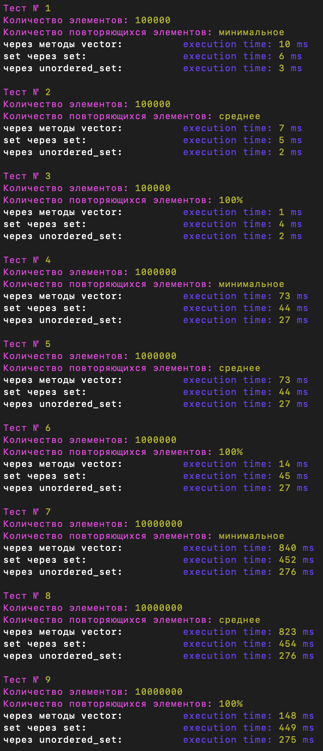

# Решение задачи - алгоритм для удаления дубликатов из вектора

Проведем тест для следующих реализаций решения задачи:

1. **С помощью методов vector**
>Сперва сортируем массив методом **sort**, после удаляем повторяющиеся элементы методом **unique** и убираем хвост методом **erase**, так как unique не изменяет количество элементов в vector.
>
>Сложность такого алгоритма будет O(N log N)
```c++
   std::sort(arr.begin(), arr.end());
   arr.erase(std::unique(arr.begin(), arr.end()), arr.end());
```
2. **С помощью вспомогательного контейнера set**
> Поиск и вставка элементов в set O(log N), а значит сложность алгоритма будет  O (N log N)
```c++
    std::set<int> temp_set;
    for (int num: src_arr) {
        temp_set.insert(num);
    }
```
3. **С помощью вспомогательного контейнера unordered_set**
> Затестим еще один контейнер **unordered_set**. Он гарантирует поиск и вставку элементов за O(1), а значит сложность алгоритма должна получится O(N)
```c++
    std::set<int> temp_set(std::make_move_iterator(src_arr.begin()),
                           std::make_move_iterator(src_arr.end()));
```

## Как запустить тестер?

В папке репозитория выполнить команду
```
make test
```

## Выводы

Как и ожидалось, наилучшие результаты показал алгоритм с вспомогательным контейнером **unordered_set**.

Тесты проводились на массивах 100.000; 1.000.000; 10.000.000 элементов, с разной наполненностью повторяющимися элементми.

